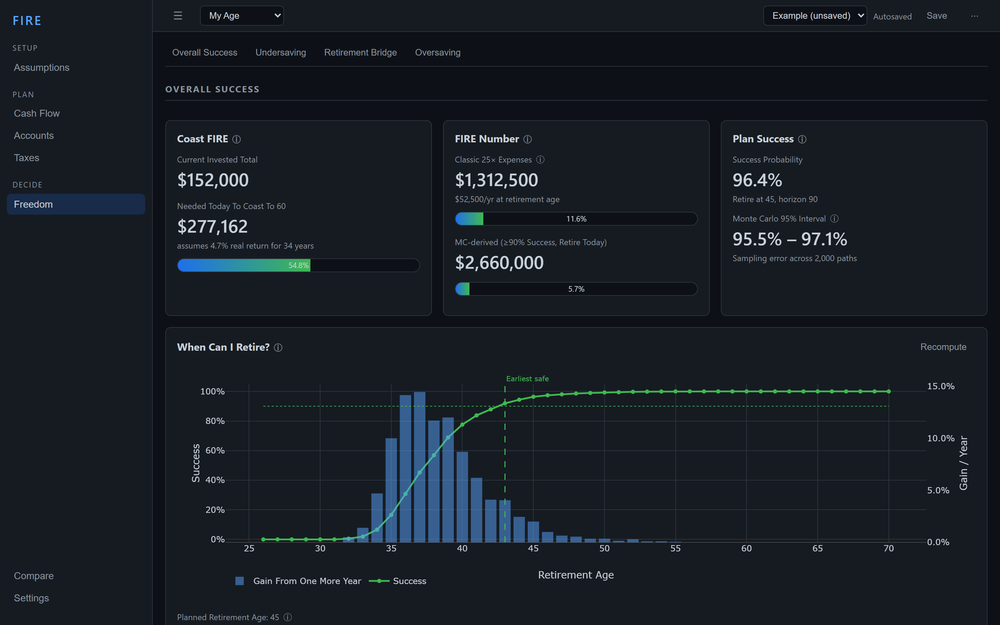

# FIRE — a Monte Carlo retirement engine for early retirement

A desktop app that simulates your real financial life — every account, tax rule,
and life event — thousands of times over, to answer the questions a spreadsheet
can't: *When can I actually retire? What's the chance my money outlives me? How
much does a Roth conversion ladder really save once you account for the Social
Security tax torpedo, ACA subsidies, and IRMAA?*



It's built around a tax-aware, vectorized simulation engine and an interface
made for **playing with futures**, not filling out forms — every slider
recomputes the whole projection in a few hundred milliseconds.

> **Read [docs/ASSUMPTIONS.md](docs/ASSUMPTIONS.md) before trusting any number.**
> Every simplifying assumption is documented there, with a note on what to keep
> in mind for real decisions.

---

## Why this isn't a spreadsheet

A retirement spreadsheet gives you one number from one set of guesses. This
models the things that actually decide an early-retirement plan:

- **Distributions, not point estimates.** Every projection is 2,000+ Monte Carlo
  paths over historical or parametric markets, so you see the *range* of
  outcomes and the **sequence-of-returns risk** that sinks early retirees — not a
  single straight line compounding at 7%.
- **Taxes modeled to the dollar, with the interactions.** Federal brackets, LTCG
  stacking, FICA, the 10% early-withdrawal penalty, **and** the second-order
  effects a spreadsheet silently ignores: the Social Security
  [tax torpedo](docs/MODELING.md#the-social-security-tax-torpedo), ACA
  premium subsidies that shrink as Roth conversions raise your MAGI, and IRMAA
  Medicare surcharges. These are *co-resolved* each year in a fixed-point loop.
- **The early-retirement bridge is first-class.** Penalty-free-age rules, the
  five-year Roth conversion ladder, conversion seasoning, and the taxable bridge
  that funds the gap before 59½ — the mechanics that make or break retiring at 45.
- **It's interactive.** Change your savings rate, retirement age, or allocation
  glidepath and watch the success probability, tax bill, and account drawdown
  move in real time.

See **[docs/FEATURES.md](docs/FEATURES.md)** for a guided tour with screenshots,
and **[docs/MODELING.md](docs/MODELING.md)** for the financial reasoning behind
the engine.

---

## Highlights

**Modeling**
- Five tax pools (taxable / traditional / Roth / HSA / cash) with basis tracking,
  Roth ordering, and conversion seasoning
- Historical **bootstrap** (Shiller 1871–2022, block-resampled to preserve
  correlation regimes) or **parametric** market models; AR(1) inflation
- Social Security via your ssa.gov estimate *or* derived from the plan's own
  35-year covered-earnings record (AIME + bend points) — the early-retiree
  correction the ssa.gov statement omits
- Guyton-Klinger spending guardrails, VPW / percent-of-portfolio decumulation,
  bracket-filled tax-aware withdrawals, RMDs, liabilities, and life events

**Decision tools**
- When-can-I-retire success sweep, success surface (age × spend), sensitivity
  tornado
- Stress tests: income shock, retire-into-a-crash, and TCJA-sunset tax reversion
- Die-with-zero estate, max sustainable spending, FIRE / Coast FIRE numbers

**Engineering**
- Pure NumPy engine, fully vectorized across paths: **2,000 paths × 65 years ≈
  185 ms**, fast enough for slider-driven recompute
- Clean three-layer split: pure Python engine → FastAPI sidecar → React +
  TypeScript + Zustand + Plotly, in a Tauri 2 desktop shell
- **220 tests** (187 Python + 33 TypeScript), input validation, deterministic
  seeded runs. Architecture in **[docs/DESIGN.md](docs/DESIGN.md)**.

---

## How many Monte Carlo paths?

Set `n_paths` (Assumptions tab) for the precision you need:

- **< 2,000 — testing/iteration.** Fast; the headline success rate is good to a
  few points — enough to see whether a change moved the needle.
- **5,000+ — a "real" runthrough.** The headline tightens to ~±1pt and the
  *tails* (shortfall depth, age-at-ruin, ending-balance percentiles) stop
  swinging run-to-run. Those are what you plan against.

Rule of thumb: raise `n_paths` until the 95% interval on the Plan Success tile is
narrower than the margin that would change your decision.

---

## Stack

- `engine/` — pure Python simulation library (NumPy, vectorized)
- `server/` — FastAPI sidecar wrapping the engine
- `src/` — React + TypeScript + Plotly frontend (Zustand store)
- `src-tauri/` — Tauri 2 desktop shell

## Setup (once)

```powershell
conda create -n fire python=3.13 numpy pandas
conda activate fire
pip install fastapi "uvicorn[standard]" pydantic pytest httpx
pip install -e engine
npm install
```

## Run (dev)

```powershell
# terminal 1 — engine sidecar
conda activate fire
python server/main.py

# terminal 2 — app (Tauri window)
npm run tauri dev
#   or browser-only: npm run dev  ->  http://localhost:1420
```

## Tests

```powershell
python -m pytest engine/tests server   # 187 Python tests
npm test                               # 33 TypeScript tests (vitest)
```

## Annual maintenance

- **November:** update `engine/fire_engine/data/tax_data.json` and `limits.json`
  with the IRS's new-year figures.
- Occasionally: `python engine/scripts/build_historical.py` to refresh the
  Shiller dataset.

## Documentation screenshots

`node scripts/capture_screenshots.mjs` re-captures `docs/img/` from the running
dev app (needs the dev server + sidecar up, with the Example scenario loaded).

## Desktop app (release build)

The desktop shortcut (`FIRE.lnk`) launches `src-tauri/target/release/fire.exe`,
which spawns the bundled Python engine (`fire-server/` next to the exe) on
startup and kills it on exit — one double-click, no terminals.

```powershell
conda activate fire
pyinstaller fire-server.spec --distpath dist-engine --noconfirm   # engine bundle
npx tauri build --no-bundle                        # app -> src-tauri/target/release/fire.exe
Copy-Item dist-engine\fire-server src-tauri\target\release\fire-server -Recurse -Force
```

Note: the engine must build into `dist-engine/`, NOT the default `dist/` — vite
empties `dist/` on every frontend build and would delete the bundle. The icon
comes from `app-icon.png`; regenerate sizes with `npx tauri icon app-icon.png`.
