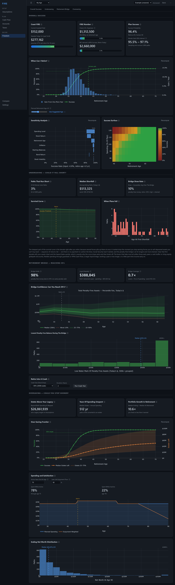
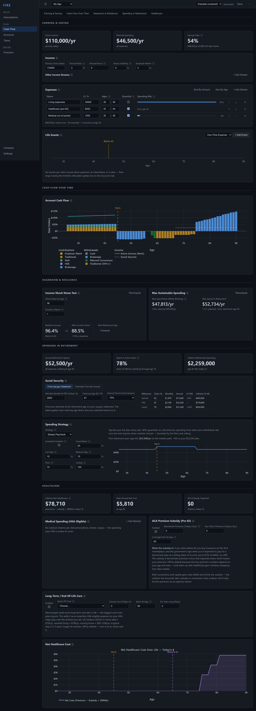
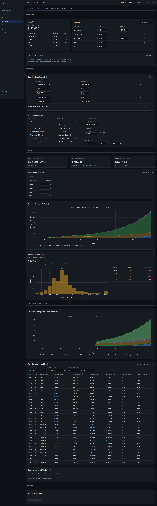
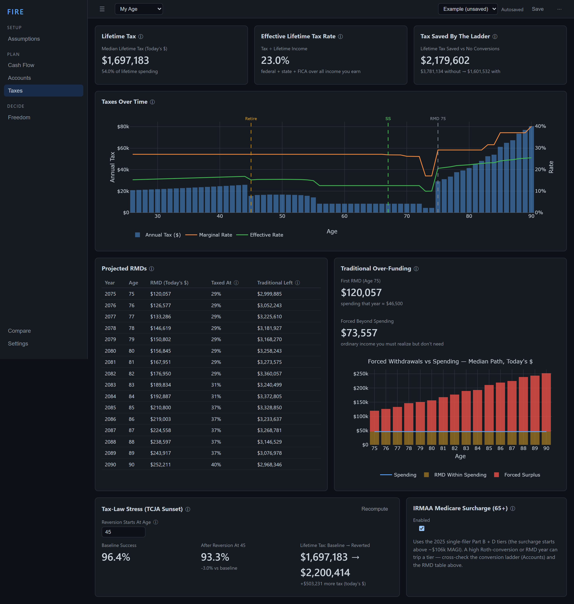
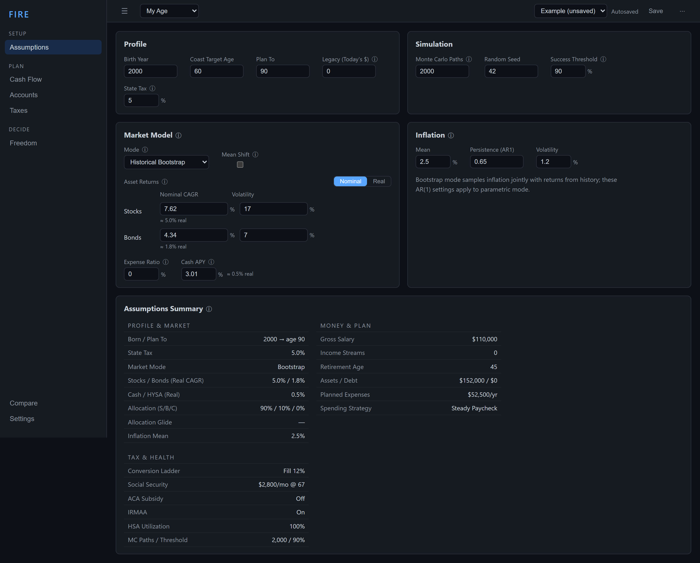

# Feature Tour

A walk through the app, tab by tab. The interface follows the planning journey:
**set your assumptions → build the plan across the money tabs → read the verdict
on Freedom.** Every screenshot below is the built-in Example scenario (a 26-year-old
earning $110k, aiming to retire at 45), and every chart is live Monte Carlo
output that recomputes as you edit.

> Throughout, inputs are *edited in context* on the tab whose charts they drive —
> income on Cash Flow, the conversion ladder on Accounts, state tax on Taxes —
> rather than buried in one giant settings form.

---

## Freedom — the retirement verdict

The tab that answers *"can I retire, and when?"*

- **Headline tiles** — success probability with a Monte Carlo 95% confidence
  interval (so you know whether a number is real or sampling noise), the
  classic 25× FIRE number *and* the simulation-derived FIRE number (the
  portfolio size where retiring today clears your success threshold), and Coast
  FIRE progress.
- **When Can I Retire?** — success probability at every candidate retirement age,
  with the "earliest safe" age marked and the marginal value of working one more
  year. The curve can be non-monotonic when a return-to-work life event sits
  past a candidate age (barista FIRE) — the model shows it honestly.
- **Success surface** — a heatmap of success across retirement age × spending
  level, so you can trade "retire later" against "spend less."
- **Sensitivity tornado** — one-at-a-time perturbation of each assumption,
  ranked by how much it moves success. Shows what your plan is actually
  sensitive to.
- **Undersaving / Oversaving sections** — survival curves, age-at-ruin and
  shortfall-severity distributions on one side; the die-with-zero estate, spending
  headroom, and ending-net-worth distribution on the other.

---

## Cash Flow — what comes in and goes out

Everything that flows across your life:

- **Income** — primary salary with nominal or real raises and an employer match,
  plus secondary income streams (side hustle, rental, spouse, barista-FIRE
  return-to-work), each with its own active window and volatility.
- **Social Security** — your ssa.gov FRA estimate, or **estimated from the plan's
  own covered-earnings history** (the early-retiree correction: zero-earning years
  after you stop working pull the benefit down, often 20–35% below a
  work-until-FRA projection).
- **Expenses & healthcare** — inflation-aware living-expense streams plus a
  first-class Healthcare tab for HSA-eligible medical spending, ACA
  premiums/subsidy, IRMAA, and long-term care.
- **Spending strategy** — constant-dollar with optional **Guyton-Klinger
  guardrails**, or a percent-of-portfolio rule (fixed % or VPW) on *accessible*
  wealth, with bounds and endowment smoothing.
- **Life events & income-shock stress** — a timeline of one-time and recurring
  flows, regime changes, and scheduled crashes; plus a what-if income shock.

---

## Accounts — assets, structure, and access

How the money is held and drawn down, in four sections (Today / Growth /
Liquidity & Drawdown / History):

- **Balances & structure** — accounts collapse into five tax pools; contribution
  waterfall (where each surplus dollar goes), withdrawal policy, asset allocation
  with an age-keyed **glidepath**, and the **Roth conversion ladder**.
- **Wealth & flows** — the percentile fan of net worth over time and the
  account-by-account drawdown.
- **Liquidity & the bridge** — the analysis that matters for early retirement:
  how much **penalty-free accessible** wealth you have before 59½, the bridge
  funding plan, and the subsidy-vs-conversion tension (conversions raise MAGI,
  shrinking ACA subsidies).
- **Maximum drawdown & history** — worst peak-to-trough distribution, plus a
  snapshot recorder and net-worth history for tracking actuals against the plan.

---

## Housing — your home as a first-class asset

One config in today's dollars from which the engine derives the whole home, so a
home you don't yet own stops *understating* your net worth (a mortgage with no
offsetting asset) and the unit traps of hand-assembling a loan + down payment +
expense streams become impossible:

- **Home & mortgage** — purchase age, price, down payment, term, rate (fixed or
  ARM), points, property tax / insurance / maintenance, and appreciation; the
  engine derives the nominal mortgage, the down-payment outflow, and the carrying
  costs from this one place. PMI auto-applies under 20% down and ends at 78% LTV.
- **Equity over time** — home value, mortgage owed, and the equity between them,
  plus a **net worth *including* home** line. The home equity is reported but kept
  **out** of the FIRE-success math — you can't spend your house.
- **Sale / downsize** — optionally sell at a chosen age and move the net equity
  (after selling costs and the §121 cap-gains exclusion) into a liquid account.
- **Loan comparison & rent-vs-buy** — instant client-side what-ifs: 15- vs 30-yr,
  fixed vs ARM, points, and whether buying beats renting-and-investing over your
  holding period.
- **Itemized deductions** — mortgage interest + (SALT-capped) property tax are
  itemized in the years they beat the standard deduction.

---

## Taxes — the consequence scoreboard

What the plan costs in tax, and where the levers are:

- **Taxes over time** — marginal and effective rates across the whole horizon,
  with the life-stage milestones (retirement, 59½, 65, RMDs at 75, SS claiming)
  marked.
- **Roth vs. Traditional** — contribution-routing comparison.
- **Lifetime tax & RMDs** — total lifetime tax in today's dollars, the RMD
  schedule, and a traditional-balance over-funding view.
- **TCJA-sunset stress** — re-runs the plan as if today's tax law reverts at a
  chosen age (higher rates, smaller standard deduction), surfacing the
  decades-scale policy risk to a low-bracket conversion-ladder thesis.
- **IRMAA** — the 65+ Medicare surcharge as a step function of MAGI.

---

## Assumptions — the exogenous backdrop

The things you can't control, plus the audit surface:

- **Market model** — historical bootstrap or parametric, with per-asset real
  CAGR and volatility, expense ratio, and dividend yield.
- **Inflation** — AR(1) with mean, persistence, and volatility.
- **Profile & simulation** — birth year, horizon, state tax, Monte Carlo path
  count, random seed (runs are deterministic), and success threshold.
- **Assumptions Summary** — a read-only audit of *every* input in one place,
  regardless of which tab it's edited on, so nothing hides.

---

## Compare & Settings

**Compare** overlays saved scenarios (and their success curves) so you can put
"retire at 45, spend less" next to "retire at 50, spend more" side by side.
**Settings** manages the add-only spending-category taxonomy used by snapshots.

---

For the financial reasoning behind these features, see
[MODELING.md](MODELING.md); for the full assumptions register,
[ASSUMPTIONS.md](ASSUMPTIONS.md); for the system architecture,
[DESIGN.md](DESIGN.md).
